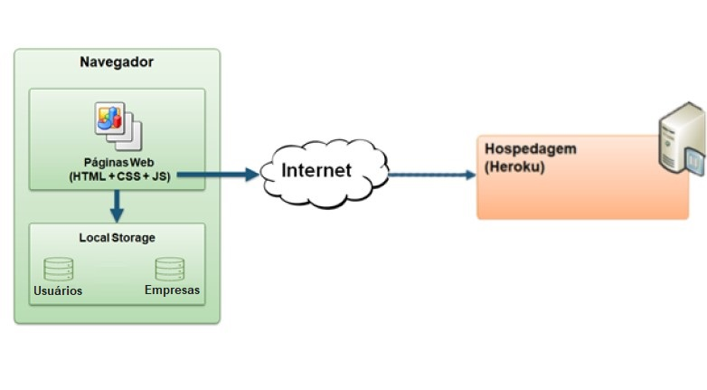
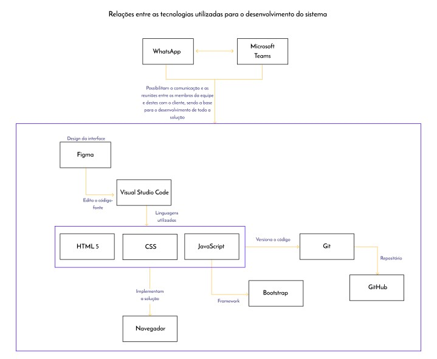

# Arquitetura da Solução

É a definição de como o software é estruturado em termos dos componentes que fazem parte da solução e do ambiente de hospedagem da aplicação. Nesse sentido, após compreendermos as necessidades dos usuários e sabermos quais são os requisitos funcionais e não funcionais, elaboramos a arquitetura da nossa solução, a fim de que possamos desenvolver o nosso projeto com maior eficácia e, com isso, entregar valor ao cliente, obtendo resultados satisfatórios.
 
Dessa forma, serão apresentados diagramas que informarão os componentes utilizados em nosso sistema, bem como o fluxo de usuários, as tecnologias e a hospedagem utilizadas no desenvolvimento da nossa solução.

## Diagrama de componentes

Diagrama que permite a modelagem física de um sistema, através da visão dos seus componentes e relacionamentos entre os mesmos, como poderá ser observado a seguir:

Figura 1 - Arquitetura da Solução

#### A solução implementada conta com os seguintes módulos:
- **Navegador** - Interface básica do sistema que permite a interação entre os usuários e o sistema.
  - **Páginas Web** - Conjunto de arquivos HTML, CSS, JavaScript e imagens que implementam as funcionalidades do sistema.
   - **Local Storage** - armazenamento mantido no Navegador, em que são implementados bancos de dados baseados em JSON. São eles: 
     - **Usuários** - Usuários cadastrados 
     - **Empresas** - Empresas cadastradas
  - **Hospedagem** - local na Internet onde as páginas são mantidas e acessadas pelo navegador. 

A imagem abaixo apresenta o fluxo de usuário em nossa solução, que será descrito detalhadamente a seguir:  

Figura 2 - Fluxo de usuário

Ao acessar a plataforma, o usuário terá acesso à tela “explore”, em que ele poderá pesquisar por oportunidades de negócios que possam proporcionar significativas experiências de mercado. 

Se o usuário decidir pela pesquisa de oportunidades e, assim, buscar um termo na caixa de pesquisa, será redirecionado para a tela de listagem, ainda na aba “explore”, em que aparecerão os resultados da busca realizada. Esses resultados irão conter o nome das empresas, as logomarcas, os interesses, a descrição, a localização e as distâncias delas em relação ao usuário, para que este tenha a oportunidade de se conectar às empresas mais próximas e, assim, potencializar o seu networking.

Caso o usuário opte por se cadastrar na plataforma, ele será redirecionado para a tela “Sign up/Sign In”, na qual preencherá dois formulários. No 1º (“sobre você”), ele deverá informar os seus dados pessoais, como o nome e o e-mail. Já no 2º (“sobre sua empresa”), serão informados os dados da empresa de cada usuário. São eles: nome; foto (logomarca); interesses; descrição; áreas de atuação; telefone; website; LinkedIn, Facebook e endereço. Vale ressaltar que esses dados informados no 2º formulário serão apresentados quando o usuário buscar por oportunidades de negócios no “explore”, conforme descrito anteriormente. 

Ao clicar no botão “quais os seus interesses?”, o usuário será redirecionado para a tela “interesses”, em que será apresentado um checkbox, no qual o usuário poderá selecionar várias opções de interesses que correspondam aos propósitos da sua empresa. 

Após preencher todos os dados dos formulários e clicar no botão “Enviar”, o usuário será redirecionado para a tela “obrigado”, na qual será apresentada uma mensagem de agradecimento pelo cadastro na plataforma, de modo a indicar que foi realizado com sucesso. A partir disso, será enviado um e-mail para o usuário, a fim de confirmar o seu endereço. Depois dessa confirmação, ele estará, de fato, inscrito na plataforma. Também é importante percebermos que na tela “obrigado” aparece o botão “Explore oportunidades de negócio perto de você”, de maneira que, ao clicar, o usuário será redirecionado para a tela “explore”, já descrita anteriormente.

Assim, após realizar o cadastro, não apenas o usuário poderá encontrar outras empresas que atendam às suas necessidades de negócio, como também a empresa dele poderá ser encontrada por outros, ao utilizarem a caixa de busca na aba “explore”. Dessa forma, as conexões poderão ser realizadas de maneira rápida e eficiente.

## Tecnologias Utilizadas

Utilizaremos algumas tecnologias, linguagens e ferramentas para o desenvolvimento do nosso sistema. São elas: 

- Ferramentas: 
    - Comunicação: **Microsoft Teams** e **WhatsApp**
   
    - Design da interface: **Figma**
    
    - Versionamento de código: **Git**

    - Repositório: **GitHub**

- IDE de desenvolvimento: **Visual Studio Code** 

- Linguagens:
    - Linguagem de marcação de texto: **HTML 5**
  
    - Linguagem de folha de estilo: **CSS**
  
    - Linguagem de programação: **JavaScript**  

- Framework: **Bootstrap**

Figura 3: Relações entre as tecnologias utilizadas no sistema

## Hospedagem

A hospedagem do sistema será realizada por meio da plataforma Heroku.

